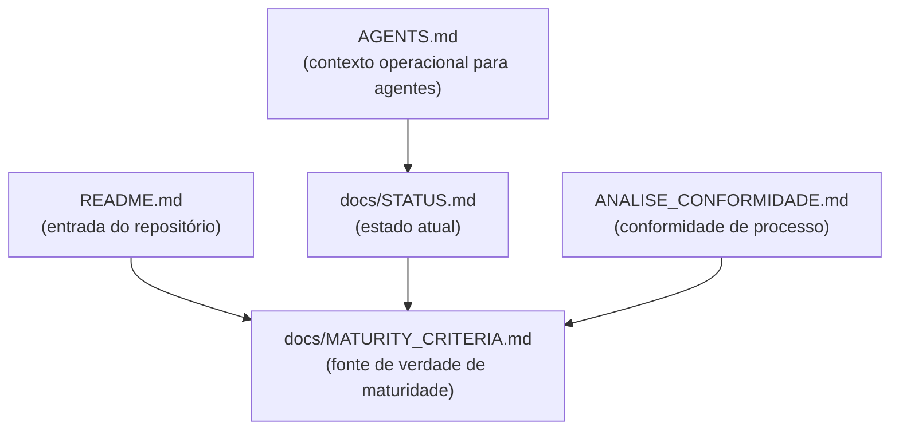

# Design Document — bootstrap-narrative-alignment

## Overview

Esta feature é puramente documental. O objetivo é calibrar a linguagem de todos os documentos do repositório para refletir o estágio real do projeto: **bootstrap funcional**, não maturidade operacional.

O problema central é que `ANALISE_CONFORMIDADE.md` usa "APROVADO PARA PRODUÇÃO" para um projeto que ainda não provou o caminho crítico com dados reais. Essa linguagem cria risco de interpretação incorreta por qualquer agente ou colaborador que leia a documentação.

Nenhum código é alterado. Nenhuma funcionalidade muda. O que muda é a narrativa.

---

## Architecture

Não há arquitetura de software envolvida. A "arquitetura" desta feature é o grafo de referências entre documentos:



`docs/MATURITY_CRITERIA.md` é o documento novo que serve como **fonte de verdade** sobre o que precisa ser provado para sair do bootstrap. Os demais documentos referenciam ele ao invés de declarar maturidade por conta própria.

---

## Components and Interfaces

### 1. ANALISE_CONFORMIDADE.md (modificar)

**Problema atual**: usa "✅ APROVADO PARA PRODUÇÃO" no cabeçalho e na conclusão.

**Mudanças concretas**:

| Localização | Texto atual | Texto novo |
|---|---|---|
| Cabeçalho — campo Status | `✅ APROVADO PARA PRODUÇÃO` | `✅ CONFORME — padrões de processo do estágio bootstrap` |
| Seção "Conclusão" — título | `✅ REPOSITÓRIO APROVADO PARA PRODUÇÃO` | `✅ REPOSITÓRIO CONFORME COM PADRÕES DE PROCESSO (estágio bootstrap)` |
| Seção "Conclusão" — corpo | "O repositório está em excelente estado... Recomendação: Prosseguir com WI-004 com confiança." | Manter métricas, substituir "confiança" por contexto calibrado (ver abaixo) |

**Seção nova a adicionar** — inserir antes da "Conclusão", chamada **"O que o bootstrap ainda não provou"**:

```markdown
## 9. O que o bootstrap ainda não provou

Conformidade com padrões de processo não equivale a prontidão operacional.
Os critérios abaixo ainda não foram validados com dados reais.
Consulte [docs/MATURITY_CRITERIA.md](docs/MATURITY_CRITERIA.md) para o status atualizado de cada um.

| Eixo | Status |
|------|--------|
| Identidade de item sob reimportações reais | ❌ Não provado |
| Matching sob crescimento de acervo | ❌ Não provado |
| Revisão humana fechando o ciclo | ❌ Não provado |
| Ingestão real sem implodir premissas do domínio | ❌ Não provado |
```

**Corpo da conclusão revisado**:

```markdown
O repositório está em conformidade com os padrões de processo do estágio bootstrap:
código de qualidade, documentação consolidada, lições aprendidas registradas,
processo de desenvolvimento funcionando.

O caminho crítico com dados reais ainda não foi provado.
Consulte [docs/MATURITY_CRITERIA.md](docs/MATURITY_CRITERIA.md) antes de considerar
o sistema operacionalmente confiável.

**Recomendação**: Prosseguir com WI-004 ou outras tarefas do backlog.
```

---

### 2. docs/STATUS.md (modificar)

**Problema atual**: seção "✅ Concluído e funcional" não distingue "funcional no bootstrap" de "provado com dados reais".

**Mudanças concretas**:

| Localização | Texto atual | Texto novo |
|---|---|---|
| Cabeçalho da seção | `### ✅ Concluído e funcional` | `### ✅ Concluído e funcional no bootstrap` |
| Nota de contexto | (não existe) | Adicionar nota logo abaixo do cabeçalho (ver abaixo) |
| Seção de riscos | Três itens existentes | Manter + adicionar dois itens sobre caminho crítico |

**Nota de contexto a inserir** logo após o cabeçalho da seção:

```markdown
> Os itens abaixo estão implementados e testados no contexto do bootstrap local-first.
> Nenhum deles foi validado com dados reais em escala operacional.
> Consulte [docs/MATURITY_CRITERIA.md](docs/MATURITY_CRITERIA.md) para os critérios de saída do bootstrap.
```

**Itens a adicionar na seção de riscos**:

```markdown
- Caminho crítico com dados reais não provado — ver docs/MATURITY_CRITERIA.md
- Linguagem de "funcional" não implica "operacionalmente confiável"
```

---

### 3. README.md (modificar)

**Problema atual**: menciona "Bootstrap" no título mas não explica o que isso significa em termos de limitações.

**Mudanças concretas**: adicionar uma seção nova chamada **"O que este bootstrap entrega — e o que ele não prova"** logo após a seção "Fluxo mínimo disponível".

**Conteúdo da seção nova**:

```markdown
## O que este bootstrap entrega — e o que ele não prova

Este repositório é um **bootstrap funcional**: a espinha dorsal arquitetural está
implementada e o loop de desenvolvimento funciona.

**O que está entregue:**
- Estrutura de domínio (entidades, value objects, contratos)
- Pipeline de importação com parser, aliases e upsert com merge policy
- Matching gerado e persistido após importação
- DTOs e mappers para desacoplamento UI ↔ domínio
- Infraestrutura de dev (testes, hooks, cobertura)

**O que ainda não foi provado:**
- Identidade de item sob reimportações com dados reais
- Matching funcionando sob crescimento real de acervo
- Revisão humana fechando o ciclo de reconciliação
- Ingestão real sem implodir premissas do domínio

Para os critérios verificáveis de saída do bootstrap, consulte
[docs/MATURITY_CRITERIA.md](docs/MATURITY_CRITERIA.md).
```

---

### 4. docs/MATURITY_CRITERIA.md (criar)

Arquivo novo. É a fonte de verdade sobre o que precisa ser provado para o sistema ser considerado operacionalmente confiável.

**Estrutura completa do arquivo**:

```markdown
# Critérios de Maturidade — saída do estágio bootstrap

Este documento define as condições verificáveis e binárias para considerar o sistema
operacionalmente confiável. Enquanto qualquer critério estiver "não provado", o projeto
está no estágio bootstrap.

**Última revisão**: [data]
**Status geral**: 🔴 Bootstrap — nenhum critério provado

---

## Critérios do caminho crítico

| # | Critério | Como verificar | Status |
|---|----------|----------------|--------|
| C1 | Identidade de item preservada sob reimportação com dados reais | Importar a mesma fonte duas vezes com dados reais; confirmar que source_key é estável e não gera duplicatas | ❌ Não provado |
| C2 | Matching funciona sob crescimento de acervo | Importar acervo com N > 1000 itens reais; confirmar que candidatos de matching são gerados sem degradação | ❌ Não provado |
| C3 | Revisão humana fecha o ciclo de reconciliação | Executar fluxo completo: importar → matching → revisar na UI → confirmar merge; confirmar que decisão persiste | ❌ Não provado |
| C4 | Ingestão real não implode premissas do domínio | Usar parser real (não mock) com dados heterogêneos; confirmar que normalização, aliases e upsert se comportam conforme esperado | ❌ Não provado |

---

## Critérios de suporte

| # | Critério | Como verificar | Status |
|---|----------|----------------|--------|
| S1 | Parser real disponível (CSV ou JSON) | MockParser substituído por parser que lê arquivo real | ❌ Não provado |
| S2 | DTOs usados na UI | Streamlit usa mappers em vez de acessar domínio diretamente | ❌ Não provado |
| S3 | mypy enforçado em hooks | pre-push bloqueia erros de tipo | ❌ Não provado |
| S4 | Trilha de auditoria de reconciliação | Decisões de merge registradas e consultáveis | ❌ Não provado |

---

## Como atualizar este documento

Quando um critério for satisfeito:
1. Alterar o campo Status de `❌ Não provado` para `✅ Provado`.
2. Adicionar data e referência ao commit ou evidência.
3. Atualizar o "Status geral" no cabeçalho.

Critérios não são marcados como provados por testes unitários isolados —
exigem execução com dados reais ou integração end-to-end.
```

---

### 5. AGENTS.md (verificar e atualizar)

**Análise**: o AGENTS.md atual não usa linguagem de produção. A seção "Estado atual" já lista o que o repositório "ainda não concluiu". Porém, não referencia `docs/MATURITY_CRITERIA.md` como fonte de verdade sobre maturidade.

**Mudança necessária**: adicionar `docs/MATURITY_CRITERIA.md` à lista "Fonte de verdade para contexto operacional" e adicionar uma linha na seção "Estado atual" que aponte para o documento de critérios.

**Adição na seção "Estado atual"**:

```markdown
Para os critérios verificáveis de saída do bootstrap, consulte `docs/MATURITY_CRITERIA.md`.
```

**Adição na lista "Fonte de verdade para contexto operacional"**:

```markdown
- `docs/MATURITY_CRITERIA.md`
```

---

## Data Models

Não há modelos de dados de software. O "modelo de dados" desta feature é o conjunto de campos que cada documento deve conter após as mudanças:

**ANALISE_CONFORMIDADE.md**
- Campo `Status` no cabeçalho: valor calibrado (sem "PRODUÇÃO")
- Seção 9 "O que o bootstrap ainda não provou": presente, com tabela dos 4 eixos
- Seção "Conclusão": sem linguagem de aprovação para produção, com link para MATURITY_CRITERIA.md

**docs/STATUS.md**
- Cabeçalho da seção de entregas: anotado com "no bootstrap"
- Nota de contexto: presente logo após o cabeçalho
- Seção de riscos: contém itens sobre caminho crítico não provado
- Link para MATURITY_CRITERIA.md: presente

**README.md**
- Seção "O que este bootstrap entrega — e o que ele não prova": presente
- Link para MATURITY_CRITERIA.md: presente

**docs/MATURITY_CRITERIA.md** (novo)
- Tabela de critérios do caminho crítico: 4 linhas (C1–C4)
- Tabela de critérios de suporte: 4 linhas (S1–S4)
- Campo Status em cada critério: binário (❌ Não provado / ✅ Provado)
- Instrução de atualização: presente

**AGENTS.md**
- Referência a MATURITY_CRITERIA.md: presente em "Fonte de verdade"
- Linha apontando para MATURITY_CRITERIA.md em "Estado atual": presente

---

## Correctness Properties

*A property is a characteristic or behavior that should hold true across all valid executions of a system — essentially, a formal statement about what the system should do. Properties serve as the bridge between human-readable specifications and machine-verifiable correctness guarantees.*

### Property 1: Ausência de linguagem de produção

*Para qualquer* documento do conjunto {ANALISE_CONFORMIDADE.md, docs/STATUS.md, README.md, AGENTS.md}, o conteúdo do arquivo não deve conter as strings "APROVADO PARA PRODUÇÃO" ou "pronto para produção" (case-insensitive).

**Validates: Requirements 1.1, 1.2, 5.2**

---

### Property 2: Presença de linguagem de bootstrap calibrada

*Para qualquer* documento do conjunto {ANALISE_CONFORMIDADE.md, docs/STATUS.md, README.md}, o conteúdo deve conter ao menos uma ocorrência de linguagem que posicione o projeto como bootstrap (e.g., "bootstrap funcional", "estágio bootstrap", "bootstrap local-first").

**Validates: Requirements 5.1**

---

### Property 3: Critérios de maturidade são binários e completos

*Para qualquer* critério listado em docs/MATURITY_CRITERIA.md, o critério deve ter: (a) um identificador, (b) uma descrição de como verificar, e (c) um campo de status com valor binário (provado ou não provado).

**Validates: Requirements 4.1, 4.3**

---

### Property 4: Referência cruzada para MATURITY_CRITERIA.md

*Para qualquer* documento do conjunto {ANALISE_CONFORMIDADE.md, docs/STATUS.md, README.md, AGENTS.md}, o conteúdo deve conter uma referência a `docs/MATURITY_CRITERIA.md`.

**Validates: Requirements 4.5**

---

## Error Handling

Esta feature não envolve código. Os "erros" possíveis são editoriais:

- **Linguagem residual de produção**: se qualquer frase com "produção" sobrar em contexto de aprovação, a Property 1 falha. Mitigação: revisar cada arquivo com busca textual antes de commitar.
- **Referência cruzada quebrada**: se um documento referenciar `docs/MATURITY_CRITERIA.md` antes do arquivo existir, o link fica morto. Mitigação: criar o arquivo antes de adicionar as referências nos demais.
- **Critério sem campo de status**: se um critério for adicionado ao MATURITY_CRITERIA.md sem o campo Status, a Property 3 falha. Mitigação: usar a tabela como template obrigatório.
- **Inconsistência de linguagem entre documentos**: se um documento usar "bootstrap funcional" e outro usar "fase inicial", a Property 2 fica ambígua. Mitigação: padronizar no termo "bootstrap funcional" ou "estágio bootstrap".

---

## Testing Strategy

Esta feature é puramente documental. Não há testes de software a escrever. A estratégia de verificação é editorial e textual.

### Verificação por inspeção (unit tests equivalentes)

Cada critério de aceitação verificável pode ser checado com uma busca textual simples:

| Verificação | Comando |
|---|---|
| Ausência de "APROVADO PARA PRODUÇÃO" | `grep -ri "aprovado para produção" ANALISE_CONFORMIDADE.md docs/STATUS.md README.md AGENTS.md` — deve retornar vazio |
| Presença de seção de limitações no README | `grep -c "O que este bootstrap entrega" README.md` — deve retornar ≥ 1 |
| Presença de seção "O que o bootstrap ainda não provou" no ANALISE | `grep -c "ainda não provou" ANALISE_CONFORMIDADE.md` — deve retornar ≥ 1 |
| MATURITY_CRITERIA.md existe | `test -f docs/MATURITY_CRITERIA.md` |
| Quatro eixos do caminho crítico presentes | `grep -c "Não provado" docs/MATURITY_CRITERIA.md` — deve retornar ≥ 4 |
| Referência ao MATURITY_CRITERIA em STATUS.md | `grep -c "MATURITY_CRITERIA" docs/STATUS.md` — deve retornar ≥ 1 |
| Referência ao MATURITY_CRITERIA em ANALISE | `grep -c "MATURITY_CRITERIA" ANALISE_CONFORMIDADE.md` — deve retornar ≥ 1 |

### Verificação das propriedades de corretude

**Property 1** — Ausência de linguagem de produção:
```bash
# deve retornar vazio
grep -ri "aprovado para produção\|pronto para produção" \
  ANALISE_CONFORMIDADE.md docs/STATUS.md README.md AGENTS.md
```

**Property 2** — Presença de linguagem de bootstrap:
```bash
# deve retornar resultado em cada arquivo
grep -li "bootstrap funcional\|estágio bootstrap\|bootstrap local-first" \
  ANALISE_CONFORMIDADE.md docs/STATUS.md README.md
```

**Property 3** — Critérios binários e completos:
```bash
# cada linha de critério deve ter "Não provado" ou "Provado"
grep -c "Não provado\|✅ Provado" docs/MATURITY_CRITERIA.md
```

**Property 4** — Referência cruzada:
```bash
# deve retornar resultado em cada arquivo
grep -l "MATURITY_CRITERIA" \
  ANALISE_CONFORMIDADE.md docs/STATUS.md README.md AGENTS.md
```

### Ordem de execução das mudanças

Para evitar links quebrados, a ordem de aplicação das mudanças deve ser:

1. Criar `docs/MATURITY_CRITERIA.md`
2. Modificar `ANALISE_CONFORMIDADE.md`
3. Modificar `docs/STATUS.md`
4. Modificar `README.md`
5. Modificar `AGENTS.md`
6. Executar todas as verificações acima
